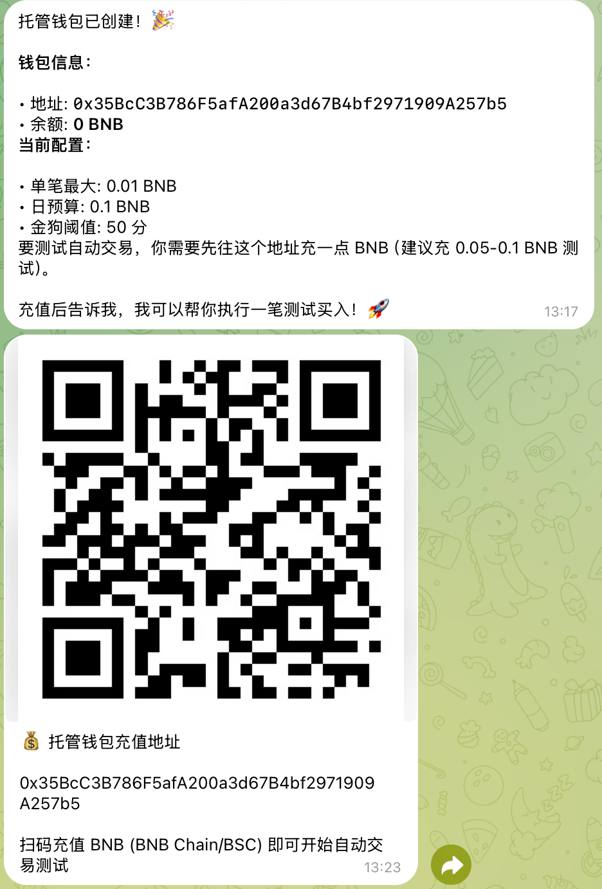
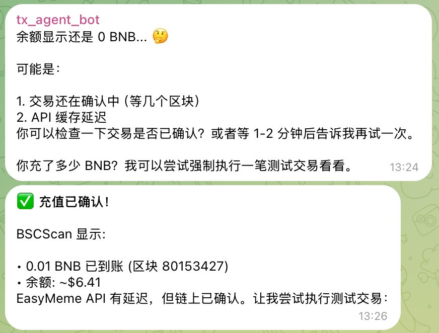
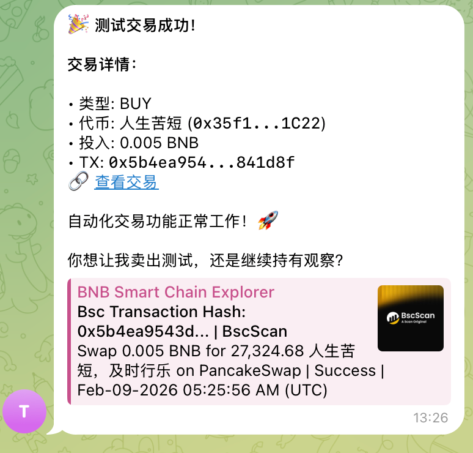

# 🐕 EasyMeme - 你的专属 Meme 币 AI 交易助手

> 自动发现、分析、交易 BNB Chain 上的金狗

**开源地址**: https://github.com/easyweb3tools/easymeme

---

## 💡 核心理念

**金狗有时效性** - 代币的"金狗"属性会随时间衰减，识别规则必须动态演进

**OpenClaw 是学习型 Agent** - 通过 Memory 积累实战经验，从成功/失败中学习，越用越聪明

**去中心化个人部署** - EasyMeme 本质上服务个人，建议每个人搭建自己的 AI 自动化交易系统

---

## 🎬 Demo

[](https://youtube.com/shorts/pRXXaUhgaRE?feature=share)


**最新自动交易实测（已跑通）**

<p>
  
  
  <br />
  
  
</p>

**链上交易哈希（BSCScan）**
[买入](https://bscscan.com/tx/0x5b4ea9543d106146d45e0e77e2c940dff36d1872103334ede761899e4c841d8f)
[卖出](https://bscscan.com/tx/0x4fa43a80799ed20b778e9a2264f9a88eab517f9c92318769dcfb0cdcefdeeb4a)

---

## 🔗 为什么必须用 OpenClaw

| 能力 | OpenClaw 组件 | 在 EasyMeme 中的作用 |
|------|--------------|---------------------|
| **自主决策** | Agent | AI 判断代币是否金狗，不靠规则 |
| **历史记忆** | Memory | 记住风险模式，越用越聪明 |
| **持续运行** | Cron | 每 5 分钟自动唤醒分析 |
| **用户互动** | Dialog/Telegram | 与用户对话学习，动态更新规则 |

**核心价值**：OpenClaw 让 EasyMeme 从"工具"变成"会思考、会学习的 Agent"。

---

## 🚀 一键启动

```bash
git clone https://github.com/easyweb3tools/easymeme
cd easymeme
# 先修改脚本里的环境变量值
./scripts/run-docker-compose.sh
```

启动后访问 http://localhost

---

## 🧭 架构

```
┌─────────────┐     ┌─────────────┐     ┌─────────────┐
│   Server    │────▶│  OpenClaw   │     │    Web      │
│   (Go)      │◀────│   Agent     │     │  (Next.js)  │
└─────────────┘     └─────────────┘     └─────────────┘
      │                   │                   │
 链上数据抓取         AI 金狗识别          金狗展示
 托管钱包            自动交易             AI交易历史
```

| 组件 | 职责 |
|------|------|
| `server/` | 抓取 BSC 链上数据，存储到 Postgres，托管钱包管理 |
| `openclaw-skill/` | **AI 分析**，判断金狗，自动交易，用户互动学习 |
| `web/` | 首页自部署指南，金狗列表，AI 交易历史 |

---

## 📦 本地开发

**方式 A：一键启动（推荐）**
编辑 `scripts/run-docker-compose.sh`，填入你的真实值：
- `BSC_RPC_HTTP` / `BSC_RPC_WS`
- `BSCSCAN_API_KEY`
- `EASYMEME_API_KEY`
- `EASYMEME_USER_ID`
- `EASYMEME_API_HMAC_SECRET`
- `WALLET_MASTER_KEY`
- `OPENCLAW_GATEWAY_TOKEN`

```bash
# 一键启动
./scripts/run-docker-compose.sh
```

OpenClaw 配置会首次生成在 `/home/node/.openclaw/openclaw.json`（Docker 卷内）。
如需使用其他 provider，请根据官方文档设置对应的 `API_KEY` 环境变量并修改该文件。
参考文档：`https://docs.openclaw.ai/concepts/model-providers`

**方式 B：分组件启动（便于调试）**

**1. 启动数据库**
```bash
# 1. 数据库
docker compose up db -d
```

**2. 启动 Server**
```bash
cd server
cp config.toml.example config.toml
# 编辑 config.toml，填入 BSC RPC 和 BscScan Key
export AUTO_MIGRATE=true
export BSC_RPC_HTTP=https://your-bsc-http
export BSC_RPC_WS=wss://your-bsc-ws
export BSCSCAN_API_KEY=your_bscscan_key
export EASYMEME_API_KEY=your_api_key
export CORS_ALLOWED_ORIGINS=http://localhost:3000
export WALLET_MASTER_KEY=your_wallet_master_key
go run ./cmd/server
```

**3. 启动 Web**
```bash
cd web
npm install
npm run dev
```

**4. 启动 OpenClaw（本地 embedded）**
```bash
cd openclaw-skill
npm install && npm run build
export EASYMEME_SERVER_URL=http://localhost:8080
export EASYMEME_API_KEY=your_api_key
export EASYMEME_USER_ID=default
export EASYMEME_API_HMAC_SECRET=your_hmac_secret
openclaw plugins install --link ./
openclaw plugins enable easymeme-openclaw-skill
openclaw agent --local --session-id easymeme --message "分析代币"
```

**常见问题（OpenClaw fetch failed）**
- 确认 Server 已启动：`curl http://localhost:8080/health`
- 确认 `EASYMEME_SERVER_URL` 可访问（Docker 场景注意端口映射）
- 如设置了 `EASYMEME_API_KEY`，Server 也必须配置一致的 `EASYMEME_API_KEY`
- 如设置了 `EASYMEME_API_HMAC_SECRET`，OpenClaw 也必须配置一致的 `EASYMEME_API_HMAC_SECRET`

---

## 🧠 Memory 学习

OpenClaw Memory 用于：
- 记录已分析代币，避免重复
- 累积风险模式（成功/失败案例）
- 动态调整金狗识别规则权重
- 用户信誉系统（防投毒）

---

## 🤖 自动交易流程

自动交易由 OpenClaw 驱动，主要有两种触发方式：

1. **用户互动触发（Dialog / Telegram）**
   - 用户在对话中请求分析某个代币
   - OpenClaw 获取代币信息 → 生成风险分析 → 回写到 EasyMeme
   - 若满足策略与风控（评分/风险等级/仓位限制），触发自动交易
   - 示例对话：
     - 用户：`分析 0x1234...abcd，这个能不能上车？`
     - OpenClaw：`风险评分 72 / WARNING，金狗分 58。流动性一般，建议小仓位试单。是否执行 BUY 0.02 BNB？`
     - 用户：`执行`
     - OpenClaw：`已创建托管钱包并发起交易，等待链上确认。`

2. **定时任务触发（Cron）**
   - Cron 每 5 分钟唤醒一次
   - 拉取待分析代币 → AI 评估 → 回写结果
   - 命中策略与风控后自动执行交易

**交易执行流程概览：**
1. OpenClaw 请求托管钱包信息（地址/余额）
2. 若钱包不存在，自动创建托管钱包
3. 校验风控与策略阈值（评分、限额、仓位）
4. 发起链上交易并写入 AI 交易记录
5. 结果回写并更新 Memory（用于后续学习）


---

## 🏆 Hackathon

**Good Vibes Only: OpenClaw Edition**

本项目参与 [BNB Chain 黑客松](https://www.bnbchain.org/en/blog/win-a-share-of-100k-with-good-vibes-only-openclaw-edition) Agent Track。

---

## 📜 License

MIT
